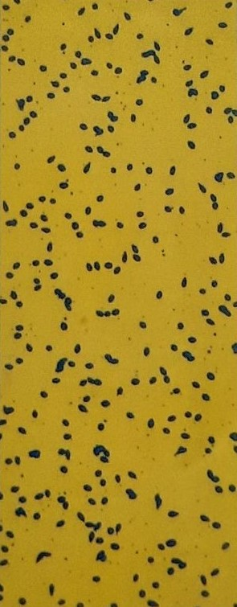
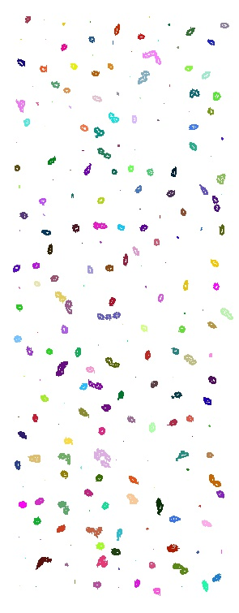
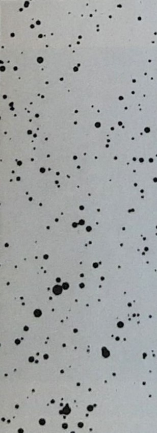

# Spot Detection using Adaptive Thresholding Methods

## Abstract
Automation of detection and measurement of diameter and density of colored spots on a sheet can be very helpful for applications such as evaluation of quality of sparying machines. In this project, I have deployed and tested the precision and overall performance of different Image thresholding and detection algorithms. I have investigated the effect of thresholding methods such as Outso in both global and local use. To obtain better results I tried to use 2-D Outso thresholding, but it was computationlly costly and time consuming so by windowing method and localizing the area of action of thresholding algorithm, I tried to obtain similar effects as 2-D Outso.

Another challenge in detection and separation of spots is due to colored dropes sliding or merging togather, in many cases detection of the multiple connected drops can be troublesome. To address this problem, I used the **Watershed Algorithm** along with **Distance Transform** to obtain the hotspots and center of each spot.

## Requirements
Python 3.8.13 was used for development of this project. Also, to install the required packages you can run the command below in the terminal.\
`$ pip install -r requirements.txt`

## Running Instruction
You can set parameters for detector in `config.yaml` file and just use the command below in the terminal.\
`$ python main.py`

## Results

  
   

  
   

